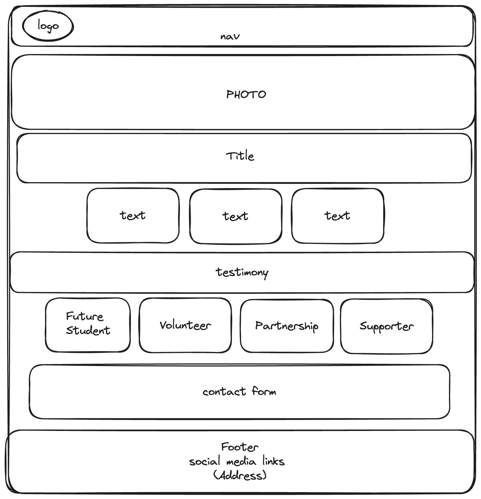

# Design

## Project's design overview

Building on the earlier design, the current approach keeps things simple.
It highlights a deep blue color and a plain white background to go well
with the HYF logo. This design aims to be user-friendly and work smoothly
with various devices.

<!-- give an overview of your project's design -->
<!-- describe the reasoning behind your group's design and wireframe -->
<!-- include other centralized decisions like fonts, palates, ... -->
**Color Palette**:

Deep Blue: `#1C2094`

White: `#FFFFFF`

**Font Family**:

Titles Font: `'Oswald', sans-serif`

Text Font: `Helvetica, sans-serif`

---

## Wireframe(s)

🎨 Link to
[wireframe](https://excalidraw.com/#room=53f8d5cd4dfc1700d016,Q5APICpMtPwl5enXNiFk6A)
